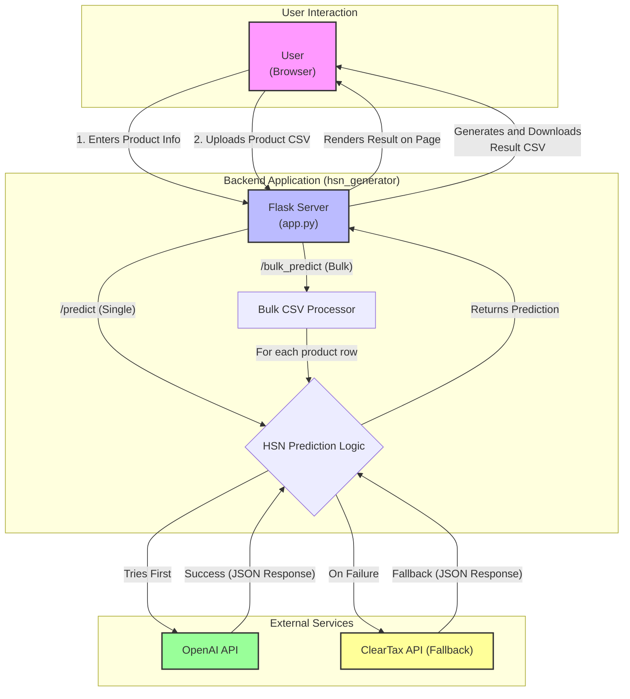

# HSN Code Predictor Architecture

This diagram illustrates the architecture of the HSN Code Predictor application, showing the flow of data from user interaction to backend processing and external API calls.

